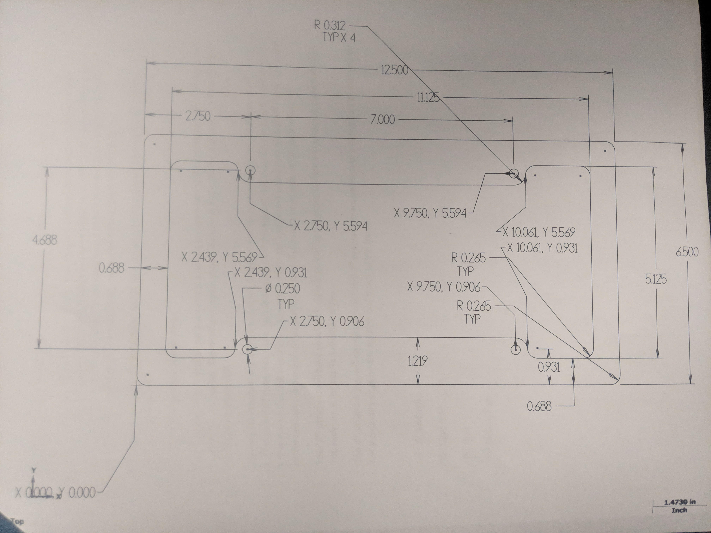
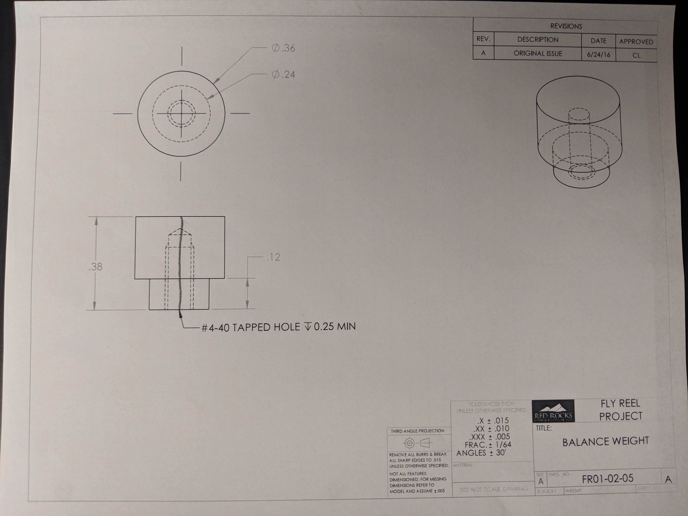
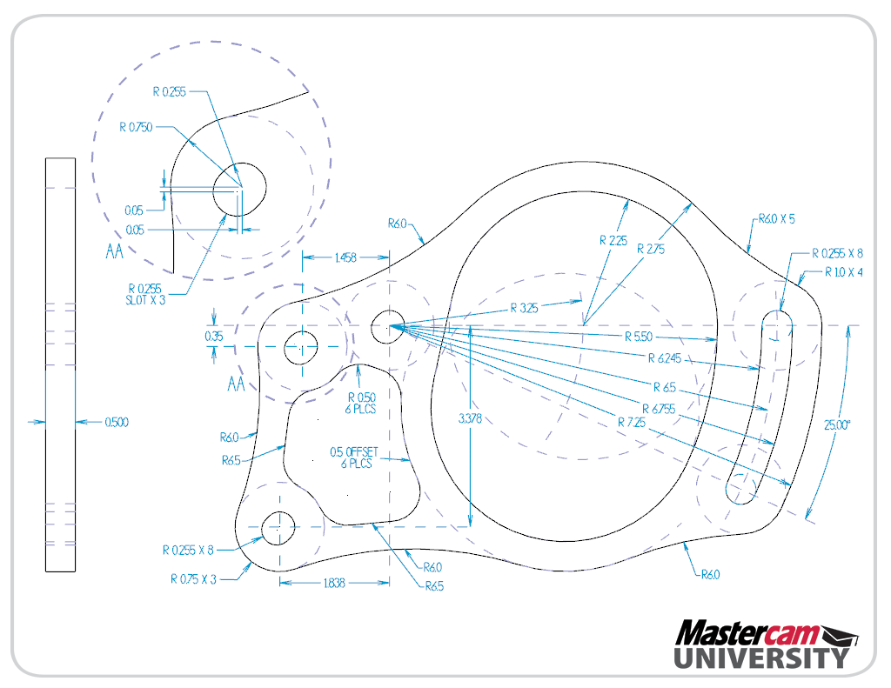

# WT-Gcode
All the G-Code for CNC machining in the Warren Tech Precision Machining Technology Class

# License Plate Frame G-Code
[02200 - Drill Cycle](/O02200.txt) 
[02201 - Countour](/O02201.txt) 
[02202 - Pocket](/O02202.txt) 
[02203 - Radius](/O02203.txt) 
[02204 - Pocket Subprogram](/O02204.txt) 
  

# Fly Reel Balance Weight G-Code
[02205 - Main Program](/02205.txt) 

# Alternator Mount Mastercam
 

